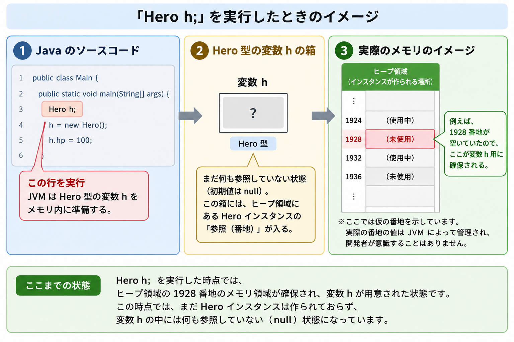
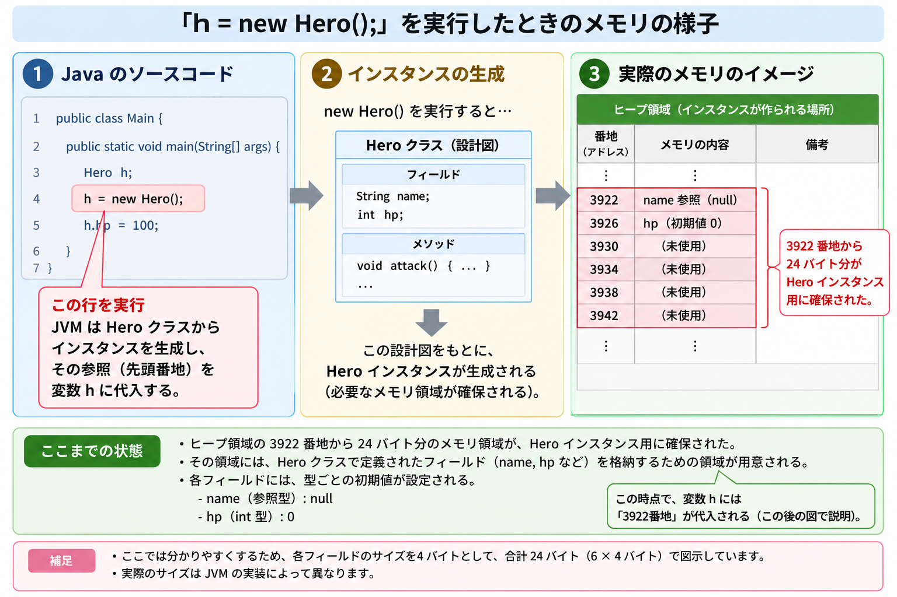
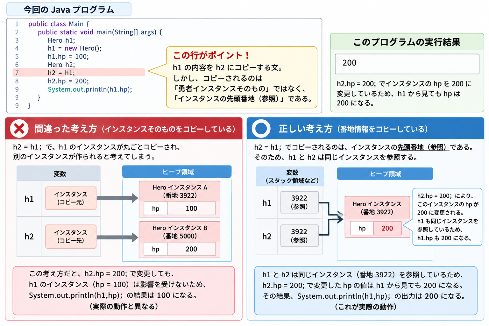
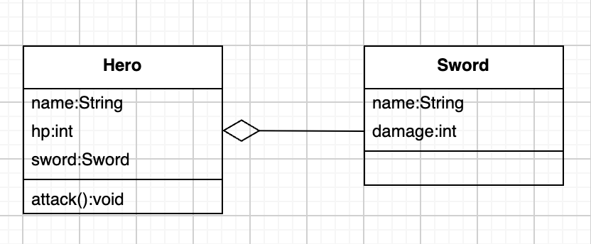
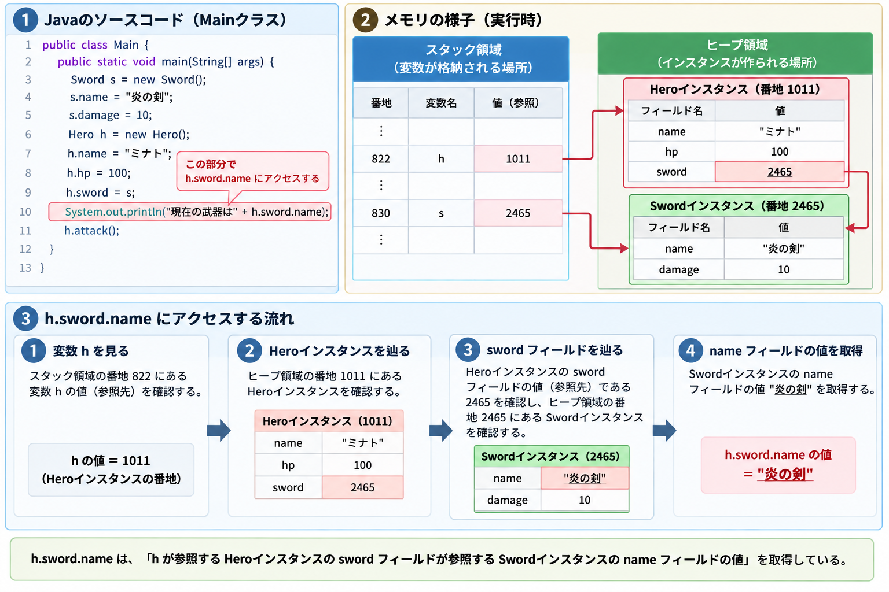
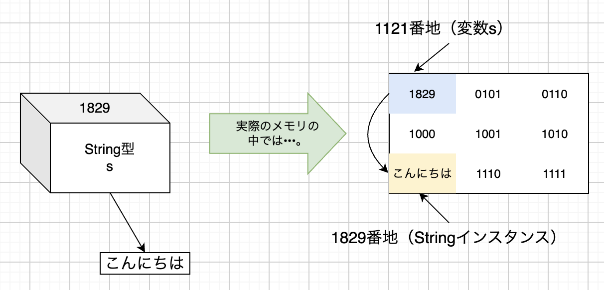

# 第9章

学習日: 2026-09-04 〜 （現在学習中）

## 学んだこと
- クラス型と参照
  - 仮想世界の真の姿
  - クラス型変数とその内容
  - STEP1:Hero型変数とその確保
  - STEP2:Heroインスタンスの生成
  - STEP3:参照の代入
  - STEP4:フィールド値への代入
  - 同一インスタンスを指す変数
  - クラス型をフィールドに用いる
  - クラス型をメソッド引数や戻り値に用いる
  - String型の真実
- コンストラクタ
  - 生まれたてのインスタンスの状態
  - フィールド初期値を自動設定する
  - コンストラクタの定義方法
  - コンストラクタに情報を渡す
  - 2つ以上の同名のコンストラクタを定義する
  - 暗黙のコンストラクタ
  - 他のコンストラクタを呼び出す

## 詰まったこと

## 用語集
- ヒープ：Javaプログラムの実行時に、生成されたオブジェクトや配列の実体を格納するメモリ領域のこと。
- 参照型：配列型(int[]型やString[]型など)とクラス型(Hero型など)の総称。
- 参照の解決：変数から番地情報を取り出し、その番地にアクセスするというJVMの動作のこと。アドレス解決ともいう。
- インスタンスの独立性：同じクラスから生まれた異なるインスタンスは互いに影響を受けない性質。
- has-a関係：あるクラスが別のクラスをフィールドとして利用している関係のこと。
- コンストラクタ：newした直後に自動的に実行される特別な性質を持ったメソッドのこと。
- デフォルトコンストラクタ：引数なし、処理内容なしのコンストラクタ。コンパイル時に自動追加される。

## 1. クラス型と参照

### 1-1. 仮想世界の真の姿

chapter07およびchapter08では、インスタンスのことを  
「操作と属性を持ち、コンピュータ内の仮想世界に生み出される登場人物」という概念的な表現で紹介してきた。  
しかし、本当に「勇者」や「お化けキノコ」のような存在がコンピュータ内に生まれ、あれこれと活躍するわけではない。

これまで「Javaの仮想世界」と表現してきたものは、  
実際にはコンピュータのメモリ領域である。  
この領域は、Javaプログラム実行時に、  
JVMがメモリ領域を大量に（通常は数百MB〜数GB）を使って準備するもので、  
これをヒープと言う。

自分たちがnewを用いてインスタンスを生み出すたびに、  
ヒープの一部の領域（通常は数十〜数百バイト）が確保され、  
インスタンスの情報を格納するために利用される。  
そのため、多くの属性を持った大きなクラスをインスタンス化すると、  
消費されるヒープ領域は必要とする容量に従って大きくなる。

つまり、インスタンスとは**ヒープの中に確保されたメモリ領域**にすぎない。

### 1-2. クラス型変数とその内容

インスタンスの正体は「ヒープの一部に確保された単なるメモリ領域」だが、  
そのインスタンスが生まれる際にコンピュータの中で何が起こっているのかを探ってみる。

chapter08/src/Main.javaの一部を抜粋し改変
```
public class Main {
    public static void main(String[] args) {
        Hero h;
        h = new Hero();
        h.hp = 100;
    }
}
```

### 1-3. STEP1:Hero型変数とその確保

上記で最初に動くのは、`Hero h;`である。  
この行を実行すると、JVMは「Hero型の変数h」をメモリ内に準備する。  
JVMはヒープ領域の中から現在利用していないメモリ領域を探し出して確保してくれる。  
仮に1928番地が空いていたとして、ここが変数h用に確保されたとする。  
以下はそのイメージである。



まだこの段階では勇者自体は生まれてはいない。  
「Hero型のインスタンスだけを中に入れることができる」Hero型の箱が準備されるだけである。  
この箱には数値や文字列を入れることはできない。  
また、Hero型ではない「お化けキノコ」インスタンスを入れることもできない。

### 1-4. STEP2:Heroインスタンスの生成

`h = new Hero();`は代入文である。  
代入は左辺より右辺の方が先に評価されるので、  
まず`new Hero()`の部分だけを考える。  
`new Hero()`が実行されると、JVMはヒープ領域から必要な量のメモリを確保する。
以下の図は、3922番地から24バイト分が確保できたときのイメージ図である。



### 1-5. STEP3:参照の代入

STEP2では、`h = new Hero();`の右辺について考えた。  
newによって生み出された勇者インスタンスは、  
変数hに代入される。  

これまで変数hに入るのは「勇者インスタンス」だと紹介してきたが、  
より厳密には勇者インスタンスの情報が書き込まれた「メモリの先頭番地」が入る。  

今回の場合、`new Hero()`により、勇者インスタンスが3922番地〜3945番地に生成されているので、  
変数hには3922という数値が代入される。

変数hに入っている3922は、ただの数値にすぎない。  
Heroインスタンスに関する名前やHPなどの様々な情報は変数hの中ではなく、  
別のところに入っている。

再度おさらいすると、  
変数hそのものは1928番地に存在しており、  
その変数hの中身は参照先の先頭番地に当たる3922が入っている。  
3922番地より24バイトを使用して、Heroインスタンスに関する名前やHPのフィールドが入る。

見方を変えれば、「この変数hにはHeroインスタンスの情報は全部入り切らないから、  
詳しくは3922番地を参照してください」と解釈できる。  
このことから、変数hに入っているアドレス情報を参照という。  

「あれ...どっかで聞き覚えのあるような...。」

実はchapter04の配列型と同じ仕組みである。

int[]型もString[]型といった「配列型」も、  
変数が入っているのは配列内の各データが保存されているメモリ領域の先頭番地である。  
Hero型のような「クラス型」も同様である。  
このことから、クラス型と配列型を総称して参照型と呼ばれる。

### 1-6. STEP4:フィールド値への代入

最後の`h.hp = 100;`では、変数hに格納されている勇者のHPを100に設定する。  
JVMは以下のように解釈して実行する。

1. 変数hの内容を調べると、「3922番地を参照せよ」と書かれている。
2. メモリ内の3922番地にあるインスタンスのメモリ領域にアクセスし、その中のhpフィールド部分を100に書き換える。

このように、まず変数から番地情報を取り出し、  
次にその番地にアクセスするというJVMの動作を  
参照の解決またはアドレスの解決という。

### 1-7. 同一インスタンスを指す変数

仮想世界に勇者が2人生成され、  
それぞれh1、h2という変数に格納されていたとする。  
勇者h1のhpフィールドを10減らしても、  
勇者h2のhpフィールドは減らない。  

同じクラスから生まれても、  
異なるインスタンスであれば互いに影響を受けないことをインスタンスの独立性という。

以下のコードの場合について考える。

```
public class Main {
    public static void main(String[] args) {
        Hero h1;
        h1 = new Hero();
        h1.hp = 100;
        Hero h2;
        h2 = h1;
        h2.hp = 200;
        System.out.println(h1.hp);
    }
}
```

このプログラムを正しく理解するためのポイントは、  
7行目の`h2 = h1;`である。  
これはh1の内容をh2にコピーする文であるが、  
勇者インスタンスhのために確保してあるメモリの先頭番地を思い出してみよう。  
ここでコピーされているのは「勇者インスタンス」ではなく、  
**3922などの番地情報**である。



代入の結果、h1とh2に同じ3922番地が入ることになる。  
したがって、h1とh2はどちらも「まったく同じ1人の勇者インスタンス」を指していることになる。  
そのため、h1のhpフィールドへ代入しても、  
h2のhpフィールドに代入しても、  
結局は同じ勇者インスタンスのHPに代入することになる。

上記のコードのプログラムの場合、  
勇者インスタンスのhpフィールドにはh1で100が代入されるが(`h1.hp = 100;`)、  
その後に同じhpフィールドにh2経由で200が上書きされる(`h2.hp = 200;`)。  
よって、最後に表示される`System.out.println(h1.hp);`は200である。

### 1-8. クラス型をフィールドに用いる

chapter09/code09-01/src/Sword.java
```
public class Sword {
    String name;
    int damage;
}
```

chapter09/code09-01/src/Hero.java
```
public class Hero {
    String name;
    int hp;
    Sword sword;

    public void attack(){
        System.out.println(this.name + "は攻撃した！");
        System.out.println("敵に5ポイントのダメージをあたえた！");
    }
}
```

Heroクラスに新しく追加されたフィールド「sword」は、  
int型やString型ではなく、Sword型である。  
このようにフィールドにクラス型を変数を宣言することも可能。  
今回の例のように、「あるクラスが別のクラスをフィールドとして利用している関係」をhas-a関係という。
図にすると以下のようになる。



「has-a」と呼ぶ理由は、以下のような英文が自然と成立するため。

**Hero has-a Sword(勇者は剣を持っている)**

この2つのクラスを利用するMainクラスは以下のようになる。

```
public class Main {
    public static void main(String[] args) {
        Sword s = new Sword();
        s.name = "炎の剣";
        s.damage = 10;
        Hero h = new Hero();
        h.name = "ミナト";
        h.hp = 100;
        h.sword = s;
        System.out.println("現在の武器は" + h.sword.name);
        h.attack();
    }
}
```

このときのメモリの様子は以下のようになる。



822番地にある変数hには、勇者インスタンスのアドレス値(1011番地)が入っている。  
そして勇者インスタンスに含まれるsword領域には、剣インスタンスのアドレス値(2465番地)が格納されている。  
すなわち、先ほどの「Hero has-a Sword」関係が成立しており、  
HeroクラスがSwordクラスをフィールドとして利用しているのがわかる。

### 1-9. クラス型をメソッド引数や戻り値に用いる

クラス型はフィールドの型に用いるだけでなく、  
メソッドの引数や戻り値の型としても利用できる。  
ここで、既にある勇者(Hero)クラスに加え、魔法使い(Wizard)クラスを作成してみる。  
魔法使いは、勇者のHPを回復する魔法(heal)をつかうことができる。

chapter09/code09-02/src/Wizard.java
```
public class Wizard {
    String name;
    int hp;

    public void heal(Hero h){
        h.hp += 10;
        System.out.println(h.name + "のHPを10回復した！");
    }
}
```
healメソッドが呼び出されると、  
魔法使いインスタンスは勇者のHPを10回復させる。  
ただし、仮想世界には勇者が2人以上生み出されている(2回以上newされている)可能性もあるため、  
呼び出されるときに「どの勇者を回復するのか」を引数hとして受け取る必要がある。  
(上記の`public void heal(Hero h)`の部分)

実際にこの魔法使いクラスを利用してみる。

chapter09/code09-02/src/Main.java
```
public class Main{
    public static void main(String[] args) {
        Hero h1 = new Hero();
        h1.name = "ミナト";
        h1.hp = 100;
        Hero h2 = new Hero();
        h2.name = "アサカ";
        h2.hp = 100;
        Wizard w = new Wizard();
        w.name = "スガワラ";
        w.hp = 50;
        w.heal(h1); // ミナトを回復させる(HP100→110)
        w.heal(h2); // アサカを回復させる(HP100→110)
        w.heal(h2); // アサカを回復させる(HP110→120)
    }
}
```
これに伴い、Heroクラスも以下に変更している。

chapter09/code09-02/src/Hero.java
```
public class Hero {
    String name;
    int hp;
}
```

### 1-10. String型の真実

chapter01から当たり前のように登場していたString型であるが、  
実はint型やdouble型の仲間ではなく**Hero型の仲間**である。  
これまで「String型変数の中には文字列がそのまま入っている」と解釈していたかもしれないが、  
本当の姿は以下のようになっている。



ここで疑問が残る。  
Hero型はSword型は自分自身でHeroクラスとSwordクラスを定義したことで使用可能になった。  
しかしStringクラスを定義していないにも関わらず、自分たちがString型を使用できるのはなぜか？  
この答えは、APIリファレンスが明らかにしてくれる。  
MathクラスやSystemクラスのようにAPIとして標準添付されている膨大な数のクラスの中に、  
Stringクラスが含まれているからである。  
(Stringクラスは正式にはjava.lang.Stringクラスである。)

詳しくは下記参照  
https://docs.oracle.com/javase/jp/8/docs/api/java/lang/String.html

これまでString型を「int型と似たようなもの」として扱い続け、  
このchapterに至るまで「実はJavaが準備してくれていたクラスを使い続けていた」と気づかなかった理由は、  
Javaというプログラミング言語が作られるときに、次のような特別の配慮をされたためである。

**①java.langパッケージに宣言されている**

chapter06で紹介した通り、java.langパッケージに所属するクラスを利用する場合、  
特例としてimport文を記述する必要がない。  
(chapter06のAPIで提供されるパッケージの項目を参照)  

本来は`java.lang.String s;`と宣言する必要があるのだが、  
単に`String s;`と書けば利用できるようになっている。

**②二重引用筆文字を囲めばインスタンスを生成して利用できる**

通常、インスタンスを生成するにはnew演算子を利用する必要がある。  
しかし文字列はプログラムの中で多用されるため、  
その都度newを書いていたらソースコードがnewだらけになってしまう。  

そこで、「二重引用符で文字列を囲めば、その文字列情報をを持ったStringインスタンスを利用できる」という特例を設けられた。  
new演算子を使うことなく`String s = "こんにちは";`というシンプルな記述が可能になっている。

実はStringもクラスには違いないので、  
HeroやSwordと同じようにnewでインスタンスを生成することもできる。  
ただし、この方法は効率が悪いので非推奨となっている。

```
public class Main{
  public static void main(String[] args){
    String s = new String("こんにちは");
    System.out.println(s);  // 画面に「こんにちは」と表示される。 
  }
}
```
3行目に`String s = new String("こんにちは");`と記述している。  
今までは`String s = new String();`と書くのが普通であるが、  
Stringクラスはnewするとき、ついでに追加情報を指定できる特別なしくみに対応している。  
このしくみについてはHeroクラスやSwordクラスにも使える。  
その特別なしくみについては後述する。

## 2. コンストラクタ

### 2-1. 生まれたてのインスタンスの状態

前節でJavaの仮想世界で起きている真実を学んだ。  
これにより、オブジェクト指向の考え方に沿って、  
インスタンスを自由に生み出して利用することができるようになった。  
しかし、実際にクラスを用いたプログラムを書き始めると、  
ある「煩わしさ」を感じるようになる。  
その例として、魔法使いクラスを利用するプログラムの一部を抜粋して下記に示す。

chapter09/code09-02/src/Main.javaの一部を抜粋
```
Hero h1 = new Hero();     //  インスタンスの生成
h1.name = "ミナト";        //  初期値セット      
h1.hp = 100;              //  初期値セット
Hero h2 = new Hero();     //  インスタンスを生成
h2.name = "アサカ";        //  初期値セット
h2.hp = 100;              //  初期値セット
Wizard w = new Wizard();  //  インスタンスを生成
w.name = "スガワラ";       //  初期値セット
w.hp = 50;                //  初期値セット
w.heal(h1);               //  ここからメインプログラム
w.heal(h2);
w.heal(h2);
```

コメントで示したように、newでインスタンスを生成した直後、  
必ずフィールドの初期値を代入している。  
newで生み出されたばかりのインスタンスのフィールド(nameやhp)には、  
まだ何も入っていないからである。

int型、short型、long型などの数値の型：0  
char型(文字)：¥u0000  
boolean型：false  
int[]型などの配列型：null  
String型などのクラス型：null

つまり、newで生み出したばかりで何もフィールドにセットしないと  
すぐにゲームオーバーになってしまう。

### 2-2. フィールド初期値を自動設定する

どうやら生まれたばかりの勇者のHPは常に100とする決まりがあったようだ。  
しかし、2-1で抜粋したコードでは、「ミナト」「アサカ」の2人の勇者は共に、  
newの直後にHPの初期値として100が代入されている。

実際の開発現場において、特にゲームなど大規模な開発を行う場合は、  
1人で全てを開発することはまずありえない。  
そのためクラスを作るにあたっては、  
自分以外の開発者がHeroクラスを利用する場面も考えておかなければならない。  
そして、それぞれの開発者が正しくHPに100を代入してくれるとは限らない。  
ある開発者はうっかり初期化を忘れるかもしれない。  
またHeroクラスを作った人が想定しないような数、  
例えば負の数や非常に大きな数で初期化してしまうかもしれない。  
これではゲームは正しく動作はしなくなるだろう。  

「勇者の初期HPが100であること」は、  
仮想世界における勇者自身に関する事柄であり、  
Heroクラスの開発者がいちばんよく知っているはず。  
逆にHeroクラスを使う側としては、  
「初期値が何であるか」は知らないのが当然とも言える。  
そのため、Heroクラスを作る側で責任を持つべきである。

このような場合に備えて、  
Javaでは「インスタンスが生まれた直後に自動実行する処理」をあらかじめ定義できるようになっている。

chapter09/code09-03/src/Hero.java
```
public class Hero {
    String name;
    int hp;
    Sword sword;

    public Hero() {
        this.hp = 100;  // hpフィールドを100で初期化
    }

    public void attack() {
        System.out.println(this.name + "は" + this.sword.name + "で攻撃した！");
        System.out.println("敵に" + this.sword.damage + "ポイントのダメージをあたえた！");
    }
}
```

上記のHeroクラスには、Hero()が追加されている。  
attack()は呼び出さないと動かないが、  
Hero()だけはこのクラスがnewされた直後に自動的に実行される特別な性質を持っている。  
このようなメソッドをコンストラクタという。

chapter09/code09-03/src/Main.java
```
public class Main {
    public static void main(String[] args) {
        Hero h = new Hero();
        System.out.println(h.hp);
    }
}
```
基本的なコンストラクタの実行の順番としては以下の通りである。

1. newを実行する。(`Hero h = new Hero();`)
2. 仮想世界にインスタンスが生まれる
3. 自動的にコンストラクタが実行される(`Hero()`でHPに100を代入する)

ここで注意することは、**コンストラクタは開発者が直接呼び出すものではない**ということ。  
自分たちがあくまで行なっていることは、  
`Hero h = new Hero();`でインスタンスを生み出すことであり、  
インスタンス生成の完了後にJVMが自動的に`Hero()`を呼び出している。  
開発者がプログラムで直接呼び出す手段はない。

### 2-3. コンストラクタの定義方法

一見すると、コンストラクタであるHero()も、他のメソッドと違いがないように見える。  
しかし、newでインスタンスを生成したときに自動実行されるのはHero()だけである。  
Javaでは、クラスに記述されているメソッドのうち、  
次の条件を全て満たすメソッドだけがコンストラクタとみなされ、  
自動実行される決まりになっている。

コンストラクタとみなされる条件
1. メソッド名がクラス名と完全に等しい
2. メソッド宣言に戻り値の型が記述されていない。(voidもダメ)

Hero()がコンストラクタとして実行されたのは、  
「Heroクラス」の中に完全に同名である「Hero()」として定義されており、  
その戻り値が記述されていないからである。

コンストラクタの定義方法は以下の通り

```
public class クラス名{
    public クラス名() {
        // 自動的に実行する処理
    } 
}

```

100などの固定値を代入するだけならば、  
コンストラクタを用いずにフィールド宣言を`int hp = 100;`としても対応できる。  
しかし次のような複雑な条件で初期化したい場合はコンストラクタを使う必要がある。

### 2-4. コンストラクタに情報を渡す

HPフィールドは固定の値で初期化すればよいため、  
単純なコンストラクタで済んだ。  
しかし勇者の名前は生み出すインスタンスによって異なる。  
このようなケースでは、コンストラクタが「毎回異なる追加情報」を引数で受け取れるようにするよう宣言する必要がある。

chapter09/code09-03/src/Hero.javaのコンストラクタ部分を抜粋
```
public Hero(String name) {
    this.hp = 100;
    this.name = name;   // 引数の値でnameフィールドを初期化
}
```
これでnewするときに名前の初期値も指定できるようになった。

自分たちは直接コンストラクタを呼べないため、  
引数を直接渡すことはできないが、  
JVMに対して、newするするときに「コンストラクタを呼ぶときはこの情報を使ってください」  
とお願いすることはできる。

引数を伴うインスタンスの生成
```
new クラス名(実引数1, 実引数2•••)
※実引数の数と型は、コンストラクタの仮引数に揃える
```

Mainクラスは以下のようになる。

chapter09/code09-03/src/Main.java
```
public class Main {
    public static void main(String[] args) {
        Hero h = new Hero("ミナト");
        
        System.out.println(h.hp);
        System.out.println(h.name);
    }
}
```

この処理は以下のようになる。

1. newする(Hero h = new Hero("ミナト");)
2. 仮想世界にインスタンスが生まれる
3. JVMによって自動的にコンストラクタが実行される。このとき引数として「ミナト」が利用される。

Hero(String name)が実行されると、
HPに100を代入し、名前に第1引数(上記では「ミナト」)を代入する。

### 2-5. 2つ以上の同名コンストラクタを定義する

早い話がコンストラクタのオーバーロードである。

現在のHeroクラスには、「文字列の引数を1つ受け取るコンストラクタ」が定義されている。  
コンストラクタはnewされたときに必ず自動的に実行されるものであるため、  
newする側としては、必ず引数となる1つ以上文字列を与える必要がある。  

このコンストラクタを作ったことによって、  
インスタンスを生成するときは、必ず名前を指定する必要が生じた。  
ここで引数なしで、`new Hero();`として実行するとエラーになってしまう。  

この問題は「引数を受け取らないコンストラクタ」も同時に定義すれば解決する。  
これが**コンストラクタのオーバーロード**である。

chapter09/code09-03/src/Hero.javaの一部を抜粋
```
public Hero() {             // 新しく作ったコンストラクタ
    this.hp = 100;
    this.name = "ダミー";    // ダミーの名前を設定する
}

public Hero(String name) {  // 以前から存在していたコンストラクタ
    this.hp = 100;
    this.name = name;
}
```
複数のコンストラクタが定義されていた場合、  
newするときに渡した引数の型・数・順番が一致するコンストラクタ1つだけが動作する。

コンストラクタをオーバーロードしたクラスを利用するMainクラスは以下の通り。

chapter09/code09-03/src/Main.javaを改変
```
public class Main {
    public static void main(String[] args) {
        Hero h1 = new Hero("ミナト");
        System.out.println(h1.name);  // 「ミナト」を出力

        Hero h2 = new Hero();
        System.out.println(h2.name);  // 「ダミー」を出力
    }
}
```

### 2-6.暗黙のコンストラクタ

コンストラクタのないHeroクラスは`new Hero();`で生成できたのに、  
引数ありコンストラクタの定義でこれが不可能になったのはなぜだろうか？

実はJavaでは、すべてのクラスはインスタンス化に際して必ず何らかのコンストラクタを実行する決まりになっている。  
そのため、本来すべてのクラスは最低でも1つ以上のコンストラクタを持ってなければならない。  
コンストラクタが1つも定義されていないのは許されない。

もしコンストラクタの定義が必須ならば以下のようになる。
```
public class Map{
  ・
  ・
  ・
  public Map(){ // newで実行したい処理は何もないが、仕方なく中身のないコンストラクタを定義
  }
}
```

このようにわざわざ中身のないコンストラクタを定義するのは面倒なので、  
Javaでは以下の特例を設けている。

クラスに１つもコンストラクタが定義されていない場合に限り、  
「引数なし、処理内容なし」のコンストラクタがコンパイル時に自動追加される。  
この「引数なし、処理内容なし」のコンストラクタをデフォルトコンストラクタという。

これまで使ってきたコンストラクタを定義する前のHeroクラスは、  
この特例によって引数なしのコンストラクタがこっそり自動的に定義されていたため、  
`new Hero();`によるインスタンス化が可能だった。

しかし新たに引数を1つを含むコンストラクタを定義した時点でこの特例は適用されなくなり、  
`new Hero();`によるインんスタンスの生成はできなくなった。

### 2-7. ほかのコンスタラクタを呼び出す

```
public Hero() {             // 新しく作ったコンストラクタ
    this.hp = 100;
    this.name = "ダミー";    // ダミーの名前を設定する
}

public Hero(String name) {  // 以前から存在していたコンストラクタ
    this.hp = 100;
    this.name = name;
}
```
上記のコードをもう一度見てみよう。  
これらのコンストラクタの内容は重複している。  
どちらのコンストラクタもHPに100を代入している。  
もし将来初期HPを200にするなどの仕様変更があったら、  
両方のコンストラクタを修正する必要がある。  
本格的なプログラムではさらに重複が多くなる。

ここで行うのは、引数なしのコンストラクタの中で引数ありのコンストラクタを呼び出すことである。  
HPへの代入を1ヶ所に集めようとすることができるだろう。
ここで使われるのが`this(引数);`である。

別のコンストラクタの呼び出しをJVMに依頼する構文
```
this(引数);
※この構文はコンストラクタの先頭に記述する
※同じクラスのコンストラクタが対象となる
```

繰り返しにはなるが、コンストラクタを呼び出せるのはJVMだけである。  
自分たちが直接呼び出すのは許されていない。  
そのため、上記の構文を使うことで、JVMにコンストラクタの起動をお願いする必要がある。  

この構文を用いて、Heroクラスを書き換えてみる。

chapter09/code09-03/src/Hero.java
```
public class Hero {
    String name;
    int hp;
    Sword sword;

    public Hero() {
        this("ダミー");
    }

    public Hero(String name) {  // 以前から存在していたコンストラクタ
        this.hp = 100;
        this.name = name;
    }

    public void attack() {
        System.out.println(this.name + "は" + this.sword.name + "で攻撃した！");
        System.out.println("敵に" + this.sword.damage + "ポイントのダメージをあたえた！");
    }
}
```

これに合わせてMainクラスも以下のように書き換えてみる。

chapter09/code09-03/src/Main.java
```
public class Main {
    public static void main(String[] args) {
        Hero h1 = new Hero("ミナト");
        System.out.println(h1.name + " HP：" + h1.hp);

        Hero h2 = new Hero();
        System.out.println(h2.name + " HP：" + h2.hp);
    }
}
```

実行結果は以下の通り

```
ミナト HP：100
ダミー HP：100
```

ちなみに、chapter08で学んだthisと今回のコンストラクタで使用しているthisは全くの別物である。  
this.メンバ名のthisは自分自身のインスタンスを表すもの。  
this(引数)のthis()は同一クラスのコンストラクタを呼び出すためのものである。  
